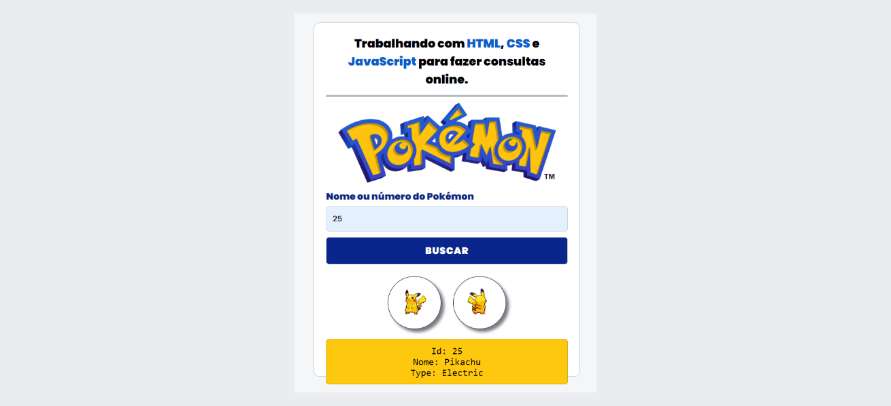

# <h1 align="center">Pokémon API</h1>

Interface consumindo api do pokémon.

## 🚀 Tecnologias utilizadas

- HTML5
- CSS3
- Javascript

Feito por Guilherme Albuquerquerque. 🤝 Entre em [contato](https://www.linkedin.com/in/guilherme-developer)